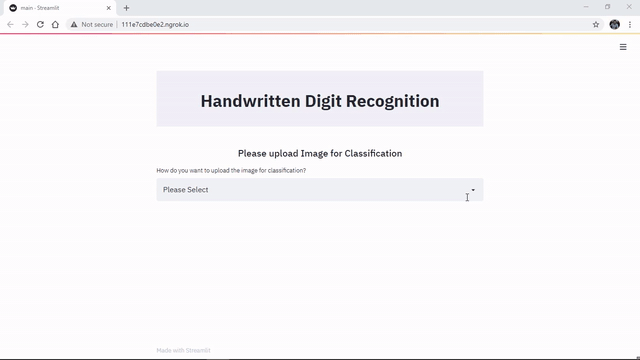

# Handwritten-text-recognition
Handwritten text recognition system implemented with TensorFlow and trained on the the MNIST database of handwritten digits. This Neural Network model will recognise a single letter or word contained in the image. We will be using Python3, numpy, TensorFlow 2.3 and OpenCV. Here's a web-based application built to allow an user to upload an image of a handwritten digit or draw them in the app itself and get a prediction by the model as to what he/she has entered.

These are the basic steps:
1) Load data from the mnist dataset
2) Normalize the data
3) Create the model and add layers
4) Compile the model  and train it.
5) Evaluate the loss and accuracy and print the same
6) Save the model
7) Load the input image
8) Invert the image(white becomes black and vice versa)
9) Model will predict on test data
10) Display the output (in grayscale)

## Guidelines for Usage

- Cloning the Repository: 

        git clone https://github.com/devanshpratapsingh/Handwritten-text-recognition
        
- Setting up the Python Environment with the dependencies:

        pip install -r requirements.txt

- Running the Web App:

        streamlit run main.py
        
- Stopping the web app from the terminal:

        Ctrl+C
        
## Demonstrating drawing the image within the Web App

